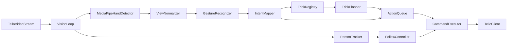

# Tello Motion Implementation Plan

This file is the repo source of truth for project direction across devices.

## Current Status

- Baseline migrated from one-file demo to modular scaffold.
- Phase 1 scaffold gate: complete.
- Last validated command: `python main.py --dry-run`.
- Next active milestone: Phase 2 Gesture/System gate.

## Current Baseline

- Existing runtime entrypoint is [main.py](../main.py) and delegates bootstrap to [src/app/bootstrap.py](../src/app/bootstrap.py).
- Modules are scaffolded in:
  - [src/tello](../src/tello/)
  - [src/vision](../src/vision/)
  - [src/control](../src/control/)
- Runtime/config placeholders exist in:
  - [config/runtime.toml](../config/runtime.toml)
  - [config/gestures.yaml](../config/gestures.yaml)
  - [config/tricks.yaml](../config/tricks.yaml)

## Target v1 Behavior

- Recognize stable hand gestures from camera frames and map them to normalized intents.
- Queue multiple gesture-driven actions safely and execute in deterministic order.
- Support adding multiple tricks as plugins without editing executor core logic.
- Provide semi-auto follow mode that proposes/locks/switches a target with multiple people in frame.
- Preserve strict separation between non-flight gate validation and flight-test gate validation.
- Keep interfaces ready for future multi-angle gesture recognition.

## Proposed Architecture

## File and Module Plan

- **Entrypoint and bootstrap**
  - [main.py](../main.py): thin launcher only.
  - [src/app/bootstrap.py](../src/app/bootstrap.py): wiring, runtime flags, module init logging, startup path.
  - [src/app/config.py](../src/app/config.py): runtime config loading and defaults.
- **Drone and safety**
  - [src/tello/client.py](../src/tello/client.py): connection/session wrapper and dry-run behavior.
  - [src/tello/safety.py](../src/tello/safety.py): arming/emergency abstractions and safety state.
- **Vision and gesture path**
  - [src/vision/stream.py](../src/vision/stream.py): frame source abstraction.
  - [src/vision/view_normalizer.py](../src/vision/view_normalizer.py): orientation normalization shim for future multi-angle support.
  - [src/vision/gestures.py](../src/vision/gestures.py): gesture detection and stabilization state machine.
  - [src/vision/tracking.py](../src/vision/tracking.py): person detection/tracking IDs and confidence.
- **Control pipeline**
  - [src/control/intents.py](../src/control/intents.py): shared intent schema and mapping.
  - [src/control/queue.py](../src/control/queue.py): queue semantics, dedupe, and ordering.
  - [src/control/executor.py](../src/control/executor.py): serialized command execution.
  - [src/control/follow_mode.py](../src/control/follow_mode.py): target-lock policy and follow controller.
  - [src/control/tricks/base.py](../src/control/tricks/base.py): trick interface and step contract.
  - [src/control/tricks/registry.py](../src/control/tricks/registry.py): trick plugin registration and discovery.
- **Configuration**
  - [config/gestures.yaml](../config/gestures.yaml): gesture mapping and thresholds.
  - [config/tricks.yaml](../config/tricks.yaml): trick declarations, trigger mapping, execution policy.

## Behavior Rules

### Gesture and queue rules

- Gesture events must pass hold and consecutive-frame stability windows.
- Cooldowns prevent repeated enqueue spam from held gestures.
- Queue accepts discrete actions and follows strict FIFO by default.
- Safety commands can clear or preempt queue execution.
- Follow control outputs and queued discrete commands must be policy-gated to avoid conflicting control signals.

### Trick extensibility rules

- Each trick plugin exposes trigger intent(s), preconditions, step sequence, and abort behavior.
- New tricks are introduced through registry/config, not executor code edits.
- Multi-step tricks are executed as grouped sequences with all-or-cancel semantics unless explicitly resumable.

### Future multi-angle gesture support

- `GestureRecognizer` stays model-agnostic to allow future classifier replacement.
- `ViewNormalizer` is the extension point for side-profile and tilted-hand support.
- Calibration hook will allow per-user angle tolerance and per-gesture thresholds.

## Validation Strategy

- Non-flight simulation harness for gesture and queue verification.
- Labeled-run logging to compute precision/recall for gesture gates.
- Unit tests for state machines, mapping logic, queue policies, and follow target policy.
- Controlled flight checklist only after related non-flight gate passes.

## Delivery Phases and Acceptance Gates

1. **Scaffold modules + config + bootstrap wiring**
   - Success check: app starts with no import/runtime errors across 10 launches, dry-run connect within 8 seconds, module-init logs present.
2. **MediaPipe gesture recognizer + `ViewNormalizer` + intent mapper**
   - Gesture/System gate: `takeoff` and `land` reach >= 90% precision and >= 85% recall across 40 labeled attempts per gesture.
   - Flight Test gate: after gate pass, 10 controlled takeoff/land runs complete with 0 unsafe transitions.
3. **Trick plugin system + queue integration**
   - Gesture/System gate: >= 3 tricks added via registry/config only, and trigger gesture maps to correct trick plan in dry-run logs.
   - Flight Test gate: after gate pass, each trick completes >= 90% across 10 attempts, with no out-of-order step execution.
4. **Action queue + executor + safety gates**
   - Gesture/System gate: FIFO correctness over 20 dry-run sequences; duplicate leakage <= 5%; emergency-stop queue clear <= 300ms.
   - Flight Test gate: after gate pass, 20 flight sequences (3-5 actions) with 100% order correctness and safe interruption behavior.
5. **Multi-person tracking + semi-auto follow lock**
   - Gesture/System gate: with 2-4 people in frame, proposal latency <= 1.0s, lock/switch success >= 90%, occlusion reacquire >= 80% for <= 2s loss.
   - Flight Test gate: after gate pass, 10 sessions (>= 60s) maintain lock >= 85% session time; unrecoverable loss always triggers safe hover.
6. **Tests/docs + end-to-end checklist**
   - Success check: coverage >= 85% for control/queue and >= 70% for vision/gesture; all tests pass.
   - Demo gate: full scenario (gesture takeoff -> queue actions -> trick -> follow lock/switch -> gesture land) passes >= 90% across 10 runs.

## Immediate Next Actions (Phase 2)

- Implement gesture event pipeline in [src/vision/gestures.py](../src/vision/gestures.py) for `takeoff` and `land`.
- Add stability filtering (hold duration + consecutive-frame confidence).
- Extend intent mapping in [src/control/intents.py](../src/control/intents.py) for phase-2 intents.
- Add labeled metrics/logging path for precision/recall gate validation before any flight testing.
